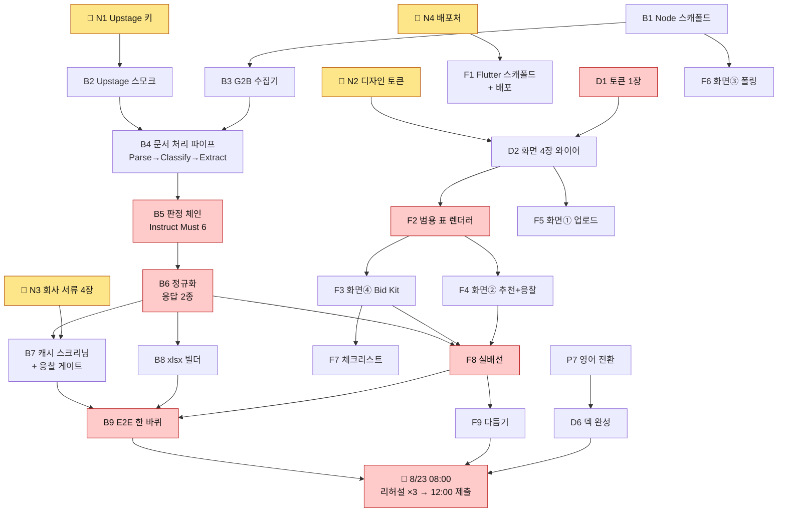
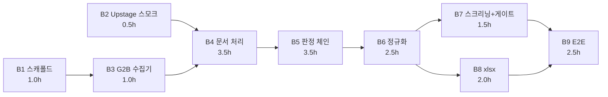
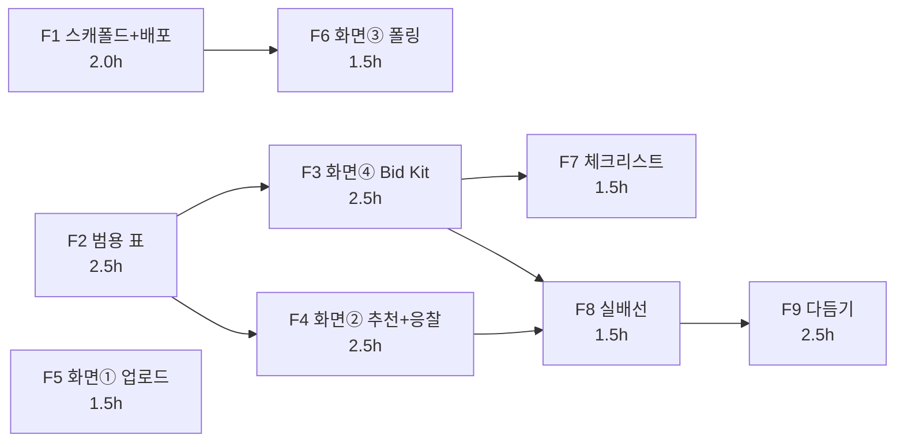
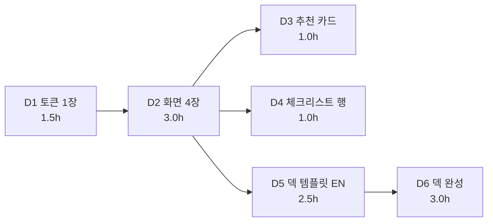
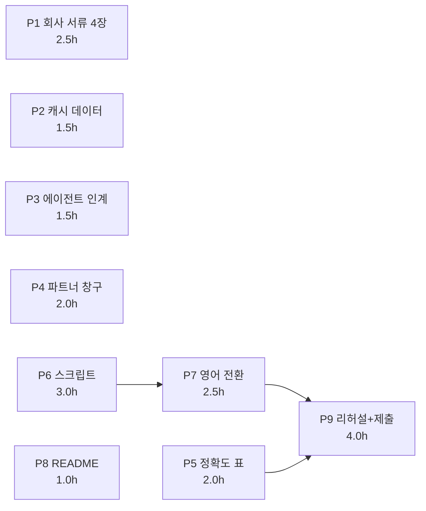

# 실행계획 — 30시간 · 사람별 WBS와 순서도

> [!warning] 공개 레포 사본 — 발주처·제안사 실명은 익명화했다
> 원본은 볼트 `30_projects/Solar_for_Bid/`이고 **권위는 볼트다**.
> 🟢 나라장터 전면 공개 공고번호(`R25BK00645031` 등)는 공개 정보라 그대로 둔다.


> [!summary] 기준 시각 **2026-08-22 06:00**
> **제출까지 30시간**(8/23 12:00 미션3). 🔴 **그러나 코드를 쓸 수 있는 벽시계는 26시간이다** — 8/23 08:00부터는 새 기능 금지, 리허설·제출 시간이다(코드레포 CLAUDE.md 「시각」).
> **유효 70 person-hour, 그중 개발자 손은 38ph.** 애플리케이션 코드는 **여전히 0줄**이다(레포에 `backend/example.md`·`front/example.md`뿐).
> 그림의 권위는 [[01_RFP_기획안]] 4-2 v1.2 확정안. 이 문서는 **그걸 누가 언제 만드는가**만 정한다.

> [!error] 🔴 **v2 (06:40) — 검증이 네 갈래 전부에서 초판을 뒤집었다**
> ① **배포 절충안이 틀렸다.** 「정적 프론트 + 백엔드 로컬」은 **심사위원 기기의 `localhost`가 그들 노트북**이라 아무것도 없다. Chrome 142 LNA가 따로 또 막는다 → 6절
> ② 🔴 **Studio가 JSON Import를 지원한다.** 「손으로 넣는다」가 틀렸다 — 손입력이 통째로 접힌다
> ③ 🔴 **그런데 Studio의 Instruct는 상류 연결이 노드당 1개다.** 우리 `_inputs`는 11개 중 9개가 2~3개를 요구한다 → **현재 JSON 그대로는 Studio에서 의도대로 안 돈다** → 4-3절
> ④ **조달청 인증키가 자동승인이다.** 캐시 폴백이 아니라 **지금 신청하면 받는다**
> ⑤ **회사 서류 2.5h → 1.0h.** 선행 과제로 걸어둔 「법령 확인」이 허구였다(존재하지 않는 서식번호)
> ⑥ 🟢 고침 완료 — **Extract 1레벨 `object` 위반 2건**(`ie_rfp_main.제안발표` · `ie_our_proposal.형식`)을 평탄화했다. Upstage IE는 1레벨에 `string|integer|number|array`만 받는다

---

## 0. 시간 예산 — 이 수부터 본다

| | 벽시계 | − 수면 | − 기타 | = 유효 |
|---|---:|---:|---:|---:|
| 길정민 (백엔드 + 에이전트) | 26 | 4 | 2 | **20ph** |
| 이용현 (프론트) | 26 | 4 | 4 | **18ph** |
| 정운 (기획) | 26 | 4 | 2 | **20ph** |
| 주예진 (디자인) | 26 | 4 | 10 | **12ph** |
| | | | **합계** | **70ph** |

🔴 **범위를 거는 수는 70이 아니라 38이다** — 개발자 손(길정민 20 + 이용현 18)만 코드를 만든다. 하드룰 2가 28시간→45ph라 했고, 26시간으로 환산하면 42ph다. **38은 그 안이다.**

> [!error] 🔴 「30시간」과 「26시간」을 섞지 말 것
> **30 = 제출까지** · **26 = 기능을 만들 수 있는 데까지.** 30으로 범위를 걸면 8/23 아침에 리허설 대신 코딩을 하게 되고, 그러면 Demo Expo 3시간이 무너진다. **이 문서의 모든 배정은 26을 기준으로 한다.**

---

## 1. 개발에 필요한 것 — 없으면 그 줄이 멈춘다

체크박스가 비어 있는 동안 **뒤에 오는 작업이 전부 대기**한다. 담당자는 이것부터 지운다.

### 1-1. 🔴 08:00까지 반드시 있어야 하는 것 (게이트)

| # | 필요한 것 | 없으면 멈추는 것 | 담당 | 확보 방법 |
|---|---|---|---|---|
| **N1** | **Upstage API 키 + Studio 계정** | 백엔드 전부 (B2 이후) | 길정민 | 계정 ✅. 크레딧 `Edu_Junction_2026` 등록 확인 · studio.upstage.ai **별도 가입**. 🔴 **에이전트를 API로 만드는 길은 없다 — Studio UI가 필수다** |
| **N2** | **디자인 토큰 1장** (색 7 · 간격 6단 · 글자 3단) | 프론트 F2 이후 전부 | 주예진 | 마크다운 한 페이지. 🔴 피그마 링크 아님 — 복붙 가능한 hex 목록 |
| **N3** | **데모용 회사 서류 4장** | S1 전체 · 데모의 첫 장면 | 정운 | 🔴 **구성 바뀜** — ①사업자등록증 ②경쟁입찰참가자격등록증 ③중소기업확인서 ④용역이행 실적증명서. HTML→헤드리스 Chrome→PDF (**실측 2.0초/장**) |
| **N4** | 🔴 **도구 설치 + 배포 경로** | F1 · 심사위원이 여는 경로 | 이용현 + 길정민 | 🔴 **이 맥에 Flutter SDK도 cloudflared도 없다.** 설치부터가 0번 작업 → 6절 |
| **N5** | **데모 경로 문장** (클릭 순서 그대로) | 리허설 · 발표 스크립트 | 정운 | 코드레포 `CLAUDE.md` 「데모 경로」 칸이 아직 비어 있다 |
| **N6** | 🆕 **조달청 OpenAPI 키** — 🟢 **자동승인이다** | S2 실호출 (없으면 캐시로 감) | 길정민 | data.go.kr 가입(본인인증 무인 → 새벽 가능) → 서비스 **15129394** 활용신청 → 즉시 발급. 🔴 **Encoding키/Decoding키를 바꿔 넣어 보는 것이 코드 30의 첫 대응** |

### 1-2. 이미 있는 것 — 다시 만들지 않는다

| 있는 것 | 어디에 | 쓰는 사람 |
|---|---|---|
| 응답 스키마 2종 | `04_계약/screening.envelope.json` · `factsheet.envelope.json` | 길정민 · 이용현 |
| **데모 JSON 2종** (손으로 채운 가짜) | `04_계약/screening.demo.json` · `factsheet.demo.json` | 🟢 **이용현이 백엔드 없이 완주하는 근거** |
| 에이전트 정의 | `02_에이전트/solar_for_bid_agent.json` (`build_agent.py`가 생성) | 길정민 |
| G2B 첨부 수집기 코드 | [[14_Solar_for_Bid_파이프라인_명세]] §0-5 | 길정민 |
| 데모 공고 첨부 5건 | `R25BK00645031` — 실호출 확인됨(키 불필요·UA 필수·422 종료) | 길정민 |
| 가상 회사 프로필 | [[15_Solar_for_Bid_가상회사_프로필]] | 정운 |

### 1-3. ⚠️ 없어도 되는 것 — 없다고 멈추지 않는다

| 없는 것 | 대체 |
|---|---|
| ~~조달청 OpenAPI 인증키~~ | 🔴 **정정 — 자동승인이라 지금 받는다**(N6). 캐시는 폴백으로만 남긴다. 🔴 다만 **목록에 오는 건 `indstrytyLmtYn`·`arsltCmptYn` 같은 Y/N 플래그뿐**이고, 실제 업종·지역은 `getBidPblancListInfoLicenseLimit`·`getBidPblancListInfoPrtcptPsblRgn`을 따로 불러 `bidNtceNo`+`bidNtceOrd`로 조인해야 한다. **실적제한 금액·건수는 어떤 API에도 없다** — 첨부 HWP Parse로 간다 |
| Postgres | 🔴 **JSON 파일 또는 인메모리로 시작한다.** 스택 동결은 포스트그레지만 26시간에 스키마·마이그레이션은 손해다. 필요해지면 그때 올린다 |
| 로그인·계정 | 하드룰 금지 |
| 테스트 프레임워크 | 코드레포 CLAUDE.md 금지 — 「테스트」는 데모 경로 한 번 돌려보기다 |

---

## 2. 사람별 WBS

표기 — **ID · 작업 · 선행 · 시간 · 완료 판정**(무엇이 보이면 끝인가).

### 2-1. 길정민 — 백엔드 + AI 에이전트 · 20ph

| ID | 작업 | 선행 | 시간 | 완료 판정 |
|---|---|---|---:|---|
| **B0** | 🔴 **Studio 프리플라이트** — 노드 2개짜리 빈 에이전트로 셋을 확인: ①Export 받아 우리 JSON과 **포맷 diff** ②**상류 2개를 한 Instruct에 물릴 수 있는가** ③프롬프트에 `#`를 붙여넣으면 참조 피커가 뜨는가 | N1 | 0.5 | 셋 다 예/아니오가 나온다 |
| **B1** | Node/Express 스캐폴드 · `/health` · `.env` 로딩 · 저장은 **JSON 파일** | — | 1.0 | `curl localhost:PORT/health` → 200 |
| **B2** | 🔴 **Upstage API 스모크** — 아무 PDF 1장을 `/v1/document-digitization`에 실제로 넣어 본다 | N1 | 0.5 | 응답 JSON에 텍스트가 들어 있다 |
| **B3** | G2B 첨부 수집기 (`fileSeq` 1..N · 422 종료 · **UA 필수**) | B1 | 1.0 | `R25BK00645031` 첨부 5개가 디스크에 떨어진다 |
| **B4** | 🔴 **Studio에 JSON Import** → Parse·Classify·Extract 확정 → Run 1회 → **Agent ID · Config 버전** 확보 | B0, B2, B3 | 3.0 | 첨부 5건이 갈리고 값이 나온다. **Agent ID가 손에 있다** |
| **B5** | 🔴 **판정 체인을 우리 코드가 돌린다** — Extract 결과를 모아 Solar Pro 4에 **Must 6 프롬프트**를 순서대로 던진다(4-3절) | B4 | 3.5 | 데모 공고 1건에서 **「추천」 + 근거 쪽번호**가 나온다 |
| **B6** | 정규화 → **응답 2종** (`screening` · `factsheet`) | B5, G2 | 2.5 | 스키마대로 나온다. 마크다운 표 → `columns`/`rows` |
| **B7** | 캐시 스크리닝 API + 🚪 **응찰 게이트** (`decision: go` → 상세 생성) | B6, N3 | 1.5 | 「127건 중 3건」이 응답에 있고 응찰이 다음 단계를 연다 |
| **B8** | xlsx 빌더 — **WBS · 임계경로만** (조견표는 웹 체크리스트라 없음) | B6 | 2.0 | 파일 2개가 열린다 |
| **B9** | **E2E 한 바퀴** + 실패 상태 · 담당자 전화번호 마스킹 | B7, B8, F8 | 2.5 | 회사 서류 업로드 → 추천 → 응찰 → Bid Kit이 **끊기지 않는다** |
| **B10** | 예비 | — | 2.0 | — |

### 2-2. 이용현 — 프론트엔드 (Flutter) · 18ph

🟢 **F2~F7은 백엔드를 기다리지 않는다.** `factsheet.demo.json`·`screening.demo.json`을 그대로 읽어 만든다. **F8이 URL만 바꾸는 작업인 이유가 이것이다.**

| ID | 작업 | 선행 | 시간 | 완료 판정 |
|---|---|---|---:|---|
| **F1** | Flutter 스캐폴드 · **4화면 라우팅** · 🔴 **배포까지 한 번** | N4 | 2.0 | 배포된 주소에서 빈 화면 4개가 열린다 |
| **F2** | **범용 표 렌더러** — `columns`/`rows` + `kind: table\|checklist` | N2, D2 | 2.5 | 데모 JSON의 탭 4개가 표로 그려진다 |
| **F3** | 화면④ **Bid Kit** — 자격 근거 · 「미확인 N건」 · 탭 4 · 다운로드 | F2, D2 | 2.5 | 데모 JSON만으로 화면④가 완성된다 |
| **F4** | 화면② **추천 목록** — 「127건 중 3건」 · 추천 카드 · 🚪 **응찰/안함** · 제외 표본 접기 | F2, D3 | 2.5 | 데모 JSON만으로 목록과 게이트가 돈다 |
| **F5** | 화면① **회사 서류 업로드존** (4장 드래그) | D2 | 1.5 | 파일 4개를 올리면 목록이 뜬다 |
| **F6** | 화면③ **처리중** — 단계 표시 · 폴링 | B1 | 1.5 | 단계가 순서대로 채워진다 |
| **F7** | **체크리스트 인터랙션** — `kind: checklist` 행 체크 (로컬 상태) | F3, D4 | 1.5 | 조견표 행을 클릭하면 체크된다 |
| **F8** | 🔴 **실배선** — 데모 JSON → 실 API로 갈아끼움 | B6 | 1.5 | 같은 화면이 실제 응답으로 돈다 |
| **F9** | 다듬기 · 실패 상태 · `cached` 칩 · 예비 | F8 | 2.5 | 부스에서 30번 눌러도 안 죽는다 |

### 2-3. 주예진 — 디자인 · 12ph

🔴 **D1이 이 프로젝트에서 가장 앞에 있는 작업이다.** 이게 늦으면 이용현이 F2부터 논다.

| ID | 작업 | 선행 | 시간 | 완료 판정 |
|---|---|---|---:|---|
| **D1** | 🔴 **토큰 1장** — 색 **7개**(bg·surface·text·textMuted·border·충족색·**미확인색**) · 간격 4/8/12/16/24/32 · 글자 3단 · 굵기 2단 | — | 1.5 | **복붙 가능한 hex 목록**이 채팅에 있다. 「피그마 보시면 됩니다」 0줄 |
| **D2** | 화면 **4장** 와이어 + 상태표 | D1 | 3.0 | 4장이 텍스트/이미지로 있고 빈 상태·실패 상태가 각각 그려져 있다 |
| **D3** | **추천 카드** 컴포넌트 — 근거 줄 · 「미확인 N건」 칩 · 마감 D-N · 응찰 버튼 2개 | D2 | 1.0 | 카드 1장 규격이 정해진다 |
| **D4** | **체크리스트 행** + 표 규격 6줄 | D2 | 1.0 | 체크 전/후 · 경고 밴드가 정해진다 |
| **D5** | 🔴 **Pitch Deck 템플릿 (영어)** — 제출 필수 | D2 | 2.5 | 표지·본문·데모 슬라이드 틀이 있다 |
| **D6** | 덱 완성 (정운 스크립트를 얹음) | D5, P6 | 3.0 | PDF로 나온다 |

> 🔴 **미확인색을 경고색으로 쓰지 말 것.** 「못 읽었다」는 오류가 아니다. 붉게 칠하면 심사위원이 실패로 읽는다 — 중립색이다.

### 2-4. 정운 — 기획 · 20ph

책임 경로에는 안 들어간다(팀과_제약). 대신 **입력과 출구**를 만든다.

| ID | 작업 | 선행 | 시간 | 완료 판정 |
|---|---|---|---:|---|
| **P1** | 🔴 **데모용 회사 서류 4장** — ①사업자등록증 ②경쟁입찰참가자격등록증 ③중소기업확인서 ④용역이행 실적증명서. **HTML→헤드리스 Chrome→PDF**(실측 2.0초/장). 직인 없이. 각 장에 **「데모용 목업 — 실제 발급 서류 아님」** 워터마크 · 번호는 `000-00-00000` 자리표시자 | — | **1.0** | PDF 4장. Parse에 넣어 값이 나오는 것까지 |
| **P2** | **캐시 스크리닝 데이터** — 127건 중 3건 + 제외 표본 | — | 1.5 | `screening.demo.json` 확장본 |
| **P3** | 에이전트 값 인계 · 프롬프트 검수 (조달 어휘 오타) | — | 1.5 | 길정민이 그대로 쓸 수 있다 |
| **P4** | 🔴 **파트너 피드백 창구** (09:00~18:00) — 4-2절 질문 | — | **2.5** | 답이 이 문서에 적힌다 |
| **P5** | 검산 · **정확도 표** (요구사항 몇 건 중 몇 건) | B5 | 2.0 | 숫자 하나가 발표에 들어간다 |
| **P6** | **발표 스크립트** 3분 / 90초 / 30초 | N5 | 3.0 | 세 길이가 각각 있다 |
| **P7** | **영어 전환** — Pitch Deck 필수 | P6 | 2.5 | 부스에서 3시간 반복 가능한 영어 |
| **P8** | `README.md` · `LICENSE` · `.env.example` (🔴 제출물이다) | — | 1.0 | 처음 보는 사람이 3줄로 실행한다 |
| **P9** | 리허설 ×3 · **시연 영상 녹화**(6절) · **미션3 제출** (12:00) | 전부 | **5.0** | 4종 제출 · status `final` 확인 |

---

## 3. 순서도

### 3-1. 전체 — 무엇이 무엇을 기다리나



### 3-2. 백엔드 — 길정민



### 3-3. 프론트 — 이용현 (🟢 백엔드를 안 기다린다)



### 3-4. 디자인 — 주예진



### 3-5. 기획 — 정운



---

## 4. 🔴 임계경로 — 여기가 밀리면 전부 밀린다

```
N1 키 → B2(0.5) → B4(3.5) → B5(3.5) → B6(2.5) → B8(2.0) → F8(1.5) → B9(2.5) → 리허설
                                                        └ 합계 16.0시간
```

**길정민이 혼자 13.5시간을 쥔다**(B2~B8). 26시간 중 절반이 한 사람 손에 있다.

| 구간 | 누가 | 왜 위험한가 |
|---|---|---|
| **B4 → B5 (7.0h)** | 길정민 | 🔴 여기가 프로젝트의 심장이자 유일한 단일 실패점. 200쪽 HWP·장문 F1 41.3 |
| **D1 → F2 (4.0h)** | 주예진 → 이용현 | 🔴 D1은 1.5시간짜리인데 **F2 이후 전부가 여기 걸려 있다.** 06:00에 시작 안 하면 프론트가 논다 |
| **B6 → F8 (4.0h)** | 길정민 → 이용현 | 🟢 데모 JSON 덕에 F8은 갈아끼우기 1.5h다. 이게 없으면 6h짜리였다 |

### 4-3. 🔴 Studio는 Instruct 하나에 상류를 **하나만** 물린다 — 그래서 판정을 우리가 돌린다

검증이 원문으로 확인했다. Studio의 `connectionMapping`은 **노드당 상류 연결이 정확히 1개**이고, 우리 `_inputs`는 **11개 중 9개가 2~3개를 요구한다.** `judge_eligibility`만 해도 `cross_check` + `ie_rfp_main` + `build_company_card` 셋이 필요하다.

**즉 지금 JSON을 그대로 Import 하면 캔버스는 그려지지만 의도대로 돌지 않는다.**

| 선택지 | 대가 |
|---|---|
| ① Extract 스키마를 합쳐 상류를 하나로 | 스키마 재설계 — 26시간에 못 한다 |
| ② 프롬프트에 `@` 참조를 심고 재배선 | `#`는 **다른 Instruct의 결정값(enumValues)만** 가져오는데 우리 노드엔 결정값이 없다 |
| 🟢 ③ **문서 처리는 Studio, 판정은 우리 코드** | **이걸 고른다** — 아래 |

🟢 **③이 트랙 요건을 더 정확히 맞춘다.** 원문은 `Upstage Studio must power the **core document-processing stages**`다. **문서 처리 단계는 Parse·Classify·Extract이고 그건 전부 Studio가 한다.** 판정 체인은 문서 처리가 아니라 추론이다.

```
Studio ─ Parse → Classify(13갈래·Split ON) → Extract(9벌)   ← 트랙이 요구하는 「코어 문서처리」
   │      Agent ID + Config 버전으로 고정, 백엔드가 Agents API로 실행
   ▼
우리 코드 ─ Extract JSON을 모아 Solar Pro 4에 Must 6 프롬프트를 순서대로
           (다중 입력이 자유롭다. 이게 ③의 이득이다)
```

🟢 **덤 둘** — Studio 경유는 **파일당 1,000쪽**을 처리한다(직접 API sync는 100쪽 한도, 우리 RFP는 15~200쪽). 그리고 Instruct 오케스트레이션을 Studio에 안 맡기므로 **B5가 우리 손 안에서 디버깅된다.**

🔴 **다만 B0에서 ②를 먼저 확인한다.** 상류 2개가 물린다면 ③을 안 써도 되고, 그때는 배점의 `agent composition` 칸이 더 두꺼워진다.

### 4-1. 되돌림 지점 둘 — 시계를 보고 자른다

> [!error] 🔴 **1차 게이트 — 8/22 20:00**
> **판정할 것: B5가 데모 공고 1건에서 「추천 + 근거 쪽번호」를 뱉는가.**
> ❌ 안 되면 → **S1(회사 서류 Parse)을 잘라낸다.** 회사 카드를 `15_가상회사_프로필`의 JSON으로 **하드코딩**하고 S3~S6에 집중한다. **−4시간 확보.**
> 화면①은 남기되 "업로드 → 이미 등록된 회사 카드 표시"로 축소한다. 데모 문장은 그대로 산다.

> [!error] 🔴 **2차 게이트 — 8/23 00:00**
> **판정할 것: B6 정규화가 응답 2종을 뱉는가.**
> ❌ 안 되면 → **전체를 캐시 데모로 고정한다.** `screening.demo.json` + `factsheet.demo.json`이 화면을 돌리고 `meta.cached: true`를 화면 구석에 띄운다.
> 🔴 **숨기지 않는다.** "사전 실행 결과입니다"를 먼저 말하는 쪽이 들키는 것보다 싸다 — 응답 스키마에 `cached` 필드를 넣어둔 이유가 이것이다.

### 4-2. 🔴 지금 확인해야 하는 것 — 백엔드에게 한 문장

> **"문서 파싱·분류·추출을 studio.upstage.ai에서 만든 에이전트가 하나요, 아니면 우리 코드가 API를 직접 부르나요? 그리고 결과는 폴링으로 받는 거 아시죠 — Studio에 webhook이 없습니다."**

트랙 원문이 `Upstage Studio must power the core document-processing stages` · `built on Upstage Studio agents`이고 배점 30점이 `agent composition`을 명시한다. 🔴 **원문에 실격 규정은 없다 — 확실한 것은 배점 손실이다.** 안전한 답은 **Studio에서 에이전트를 만들고 백엔드가 Agents API로 실행**하는 것이다.

---

## 5. 일정표 — 시각별

🛌 = 수면 · 🔴 = 임계경로 · 🚪 = 게이트

| 시각 | 길정민 (백엔드·에이전트) | 이용현 (프론트) | 주예진 (디자인) | 정운 (기획) |
|---|---|---|---|---|
| **06:00–08:00** | 🔑 N1 키 확인 · **B1**(1.0) · 🔴**B2**(0.5) | 🚀 N4 배포처 · **F1**(2.0) | 🔴 **D1 토큰**(1.5) | 🔴 **P1 회사 서류**(2.0) |
| **08:00–12:00** | **B3**(1.0) · 🔴**B4** 착수(3.0) | 🛌 수면 | **D2**(3.0) | P1 마무리(0.5) · **P2**(1.5) · **P4 창구**(2.0) |
| **12:00–16:00** | 🛌 수면 | 🔴**F2**(2.5) · **F5**(1.5) | **D3**(1.0) · **D4**(1.0) · 🛌 | **P3**(1.5) · **P8**(1.0) · P4 이어감 |
| **16:00–20:00** | 🔴**B4** 완료(0.5) · 🔴**B5**(3.5) | **F3**(2.5) · **F4** 착수(1.5) | 🛌 수면 | **P5**(2.0) · **P6** 착수(2.0) |
| **🚪 20:00** | — | — | — | **1차 게이트 — B5가 판정을 뱉는가** |
| **20:00–24:00** | 🔴**B6**(2.5) · **B7**(1.5) | **F4** 완료(1.0) · **F6**(1.5) · **F7**(1.5) | **D5 덱 EN**(2.5) | **P6** 완료(1.0) · **P7 영어**(2.5) |
| **🚪 8/23 00:00** | — | — | — | **2차 게이트 — B6가 응답 2종을 뱉는가** |
| **00:00–04:00** | 🔴**B8**(2.0) · **B9** 착수(2.0) | 🔴**F8**(1.5) · **F9**(2.5) | **D6 덱 완성**(3.0) | 🛌 수면 |
| **04:00–08:00** | 🔴**B9** 완료(0.5) · **B10 예비**(2.0) · 🛌 | 🛌 수면 | 🛌 | **P9 리허설 준비**(2.0) |
| **🔴 8/23 08:00** | **새 기능 금지** — 여기서 코드는 끝난다 | | | |
| **08:00–12:00** | 리허설 지원 · 버그만 | 리허설 지원 · 버그만 | 덱 마감 | 🔴**P9 리허설 ×3 · 12:00 제출** |
| **12:00–13:00** | Expo 세팅 | | | |
| **13:00–16:00** | **Demo Expo 3시간** — 같은 설명을 수십 번 | | | |
| **16:00–17:00** | **Final Pitch 5분** | | | |

### 5-1. 수면 교대 — 겹치지 않게

| | 8/22 08–12 | 8/22 12–16 | 8/22 16–20 | 8/23 00–04 | 8/23 04–08 |
|---|:---:|:---:|:---:|:---:|:---:|
| 길정민 | 작업 | 🛌 | 작업 | 작업 | 🛌 |
| 이용현 | 🛌 | 작업 | 작업 | 작업 | 🛌 |
| 주예진 | 작업 | 🛌 | 🛌 | 작업 | 🛌 |
| 정운 | 작업 | 작업 | 작업 | 🛌 | 작업 |

🔴 **길정민과 이용현이 동시에 자지 않는다.** 8/23 04:00~08:00만 둘 다 쉬는데, 그때는 이미 새 기능 금지 구간에 붙어 있다.

---

## 6. 🔴 배포 — 초판의 절충안이 틀렸다

> [!error] 🔴 제가 06:00에 쓴 「프론트만 배포 + 백엔드는 로컬」은 **작동하지 않는다**
> 심사위원이 배포된 프론트를 자기 노트북에서 열면, 그 페이지가 부르는 `http://localhost:3000`은 **심사위원 노트북의 3000번 포트**다. 거기엔 아무것도 없다.
> 🔴 **원인을 CORS로 오진하면 몇 시간을 엉뚱한 데 쓴다.** CORS도 mixed content도 아니다 — origin 규칙이다.
> 게다가 **Chrome 142부터 Local Network Access 권한 프롬프트**가 정식 탑재돼, 공개 origin에서 loopback·사설 IP로 가는 `fetch`에 사용자 허용을 요구한다. 거부하면 실패한다. 같은 wifi에서 LAN IP로 우회하는 것도 행사장 wifi의 client isolation에 막힐 수 있다.

### 6-1. 실제로 통하는 경로

| 무엇 | 어떻게 | 왜 이걸로 |
|---|---|---|
| **백엔드** | 🟢 **Cloudflare quick tunnel**<br>`brew install cloudflared`<br>`cloudflared tunnel --url http://localhost:3000` | **계정도 로그인도 불필요.** 로컬 백엔드에 공개 HTTPS URL이 붙는다. 카드 등록 불가·배포 경험 0인 이 팀에 맞는 가장 싼 경로 |
| **프론트** | 🟢 **Netlify Drop** — `build/web` 폴더를 브라우저에 끌어다 놓는다 | 로그인 없이 2~5분. 🔴 **단 링크를 심사위원에게 주려면 GitHub 계정으로 claim** 해야 한다(미claim 시 임시 비밀번호가 걸린다) |
| **CORS** | `npm i cors` + `app.use(cors())` | origin이 둘이라 필요하다. preflight까지 자동. 🔴 쿠키 세션을 쓰면 와일드카드가 안 되니 **인증은 넣지 않는다** |

### 6-2. 🔴 코드 첫 줄 쓰기 전에 정해야 하는 것 하나

**quick tunnel URL은 `cloudflared`를 재시작할 때마다 바뀐다.** 노트북이 잠들거나 프로세스가 죽으면 배포된 프론트가 통째로 죽는다.

→ **API base URL을 빌드에 하드코딩하지 않는다.** 쿼리파라미터나 별도 `config.json` fetch로 **런타임에 갈아끼울 수 있게** 짠다. 그래야 부스에서 재빌드 없이 **30초 만에 복구**된다. 이건 F1에서 정해야 하고, 나중에 고치면 재빌드·재배포다.

**운영 항목 둘** — ① 노트북 절전 해제(`caffeinate -dimsu`) ② **터널 URL 교체 담당자 1명**을 정해둔다.

### 6-3. 🔴 제출 링크에는 터널 URL을 넣지 않는다

터널은 **부스 시연**을 살리지만 노트북이 꺼지면 죽는다. 미션3 제출은 비동기 심사다.

→ 제출에는 **정적 프론트 URL + 시연 영상 링크**를 넣는다. 영상은 노트북 상태와 무관하다. **P9에 녹화를 넣은 이유가 이것이다.**

### 6-4. Flutter 함정 셋 — 검색하면 틀린 답이 먼저 나온다

| 🔴 함정 | 실제 |
|---|---|
| `flutter build web --web-renderer html` | **Flutter 3.29에서 `--web-renderer`가 제거됐다.** 인터넷의 「흰 화면 고치는 법」 대부분이 이걸 시키는데 지금 실행하면 죽는다 |
| **GitHub Pages** | 🔴 **고르지 마라.** project site가 `/repo/` 하위경로라 Flutter 기본 `<base href="/">`와 어긋나 흰 화면이 뜬다. 배포 첫 경험으로 고르면 원인을 못 찾는다 |
| 부스 wifi가 나쁘면 흰 화면 | Flutter web이 CanvasKit을 gstatic CDN에서 받아온다. `flutter build web --release --no-web-resources-cdn`로 로컬 번들링. 🔴 **Netlify Drop은 개별 파일 10MB 넘으면 배포가 멈추니** 번들 크기를 함께 본다 |

🔴 **이 맥에 Flutter SDK도 `cloudflared`도 없다.** SDK 내려받는 시간을 F1 앞에 따로 잡아야 한다 — **N4가 「배포처 결정」이 아니라 「도구 설치」인 이유다.**

## 7. 이 계획이 스스로 검사하는 것

| 검사 | 값 | 판정 |
|---|---:|---|
| 개발자 손 합계 | 38ph | 🟢 하드룰 2(26h→42ph) 안 |
| 길정민 배정 | 20.0ph / 20ph | 🟡 여유 0 — B10 예비 2h가 유일한 완충 |
| 이용현 배정 | 18.0ph / 18ph | 🟡 여유 0 — F9에 예비 포함 |
| 주예진 배정 | 12.0ph / 12ph | 🟢 |
| 정운 배정 | 20.0ph / 20ph | 🟢 |
| 임계경로 | 16.0h / 26h | 🟢 여유 10h — 게이트 둘이 그 여유를 지킨다 |
| Should 5 (질의서·배점해부·계약리스크·제출체크·커버리지) | — | 🔴 **범위 밖.** 시간이 남으면 붙인다 |

> [!warning] 🔴 여유 0이 두 사람이다
> 길정민·이용현 모두 배정이 가용 시간과 정확히 같다. **한 번의 3시간짜리 사고가 곧 기능 하나다.** 그래서 게이트 둘이 있다 — 20:00과 00:00에 시계를 보고 **자르는 결정**을 한다. 안 자르면 8/23 아침에 리허설 대신 코딩을 하게 된다.

## 관련

- [[01_RFP_기획안]] · [[03_WBS_RR]] · [[00_Solar_for_Bid-MOC]] · [[15_Solar_for_Bid_가상회사_프로필]]
